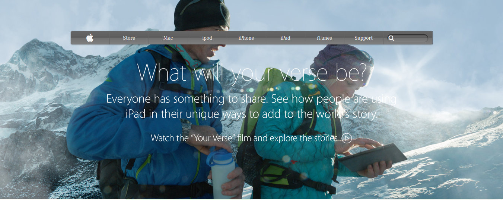

# Apple

> To make a clone of an old version of the [Apple website](https://web.archive.org/web/20140301004610/http://www.apple.com/).

## Implementation Details

[See wiki pages](https://github.com/cliftondavies/Apple/wiki)

## Technologies Used

- HTML, CSS.
- Github, Git, Visual Studio Code.

## Live Demo

[Live Demo Link](https://cliftondavies.github.io/Apple/)

## Authors

👤 **Clifton Davies**

- Github: [@githubhandle](https://github.com/cliftondavies)
- Twitter: [@twitterhandle](https://twitter.com/cliftonaedavies)
- Linkedin: [linkedin](https://www.linkedin.com/in/clifton-davies-mbcs/)

## 🤝 Contributing

Contributions, issues and feature requests are welcome!

Feel free to check the [issues page](https://github.com/cliftondavies/Apple/issues).

## Show your support

Give a ⭐️ if you like this project!

## Acknowledgments

- The Corgis!

## 📝 License

This project is [MIT](https://opensource.org/licenses/MIT) licensed.
